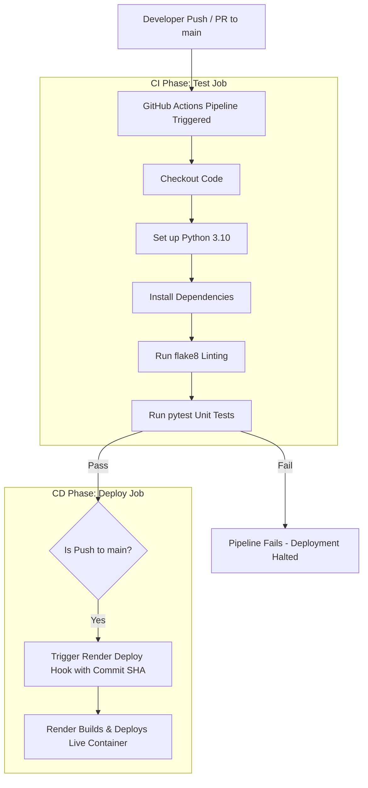

Here is a complete, production-ready **`README.md`** file tailored for your **Gourmet Paradise Recipe Book** assignment.

Replace the contents of your local `README.md` file with the markdown block below:

```markdown
# 🍽️ Gourmet Paradise Recipe Book

A lightweight, containerized Python Flask web application for exploring gourmet recipes, built with quality verification, automated CI/CD pipelines, and cloud deployment.

---

## 📌 Project Overview
The Gourmet Paradise Recipe Book provides a dynamic menu interface and RESTful API endpoints for managing recipe items. The project incorporates modern DevOps practices, including automated linting (`flake8`), unit testing (`pytest`), Docker containerization, and automated deployments to Render via GitHub Actions.

### Features
* **Dynamic Menu & REST API:** Render recipe collections and access raw JSON endpoints (`/api/recipes`).
* **Health Check Endpoint:** Automated health verification via `/health`.
* **Automated Code Quality:** Code formatting enforced with `flake8` and test suites executed via `pytest`.
* **Containerized Deployment:** Dockerized multi-stage setup for consistent execution across environments.
* **Commit Tracking:** Live site footer dynamically displays the deployed `RENDER_GIT_COMMIT` hash.

---

## 🚀 How to Run Locally

### Prerequisites
* Python 3.10+
* Git
* Docker (Optional, for containerized local execution)

### Method 1: Local Python Environment

1. **Clone the repository:**
   ```bash
   git clone [https://github.com/nupurloni-cmd/recipe-book.git](https://github.com/nupurloni-cmd/recipe-book.git)
   cd recipe-book

```

2. **Create and activate a virtual environment:**
```bash
# Windows (CMD)
python -m venv venv
venv\Scripts\activate

# Linux / macOS
python3 -m venv venv
source venv/bin/activate

```


3. **Install dependencies:**
```bash
pip install -r requirements.txt
pip install pytest flake8

```


4. **Run code quality checks and unit tests:**
```bash
# Code linting
flake8 . --max-line-length=120 --exclude=venv,.venv

# Run test suite
pytest

```


5. **Start the Flask development server:**
```bash
python app.py

```


Open your browser at `http://127.0.0.1:5000` or `http://localhost:5000`.

---

### Method 2: Running with Docker

1. **Build the Docker image:**
```bash
docker build -t recipe-book .

```


2. **Run the container:**
```bash
docker run -p 5000:5000 recipe-book

```


Access the containerized application at `http://localhost:5000`.

---

## 🔄 CI/CD Pipeline Architecture

The application utilizes GitHub Actions for continuous integration and automated deployment to Render.



---

## 🔗 Quick Links

* **GitHub Repository:** [https://github.com/nupurloni-cmd/recipe-book](https://www.google.com/search?q=https://github.com/nupurloni-cmd/recipe-book&utm_source=gemini)
* **GitHub Actions Pipeline:** [https://github.com/nupurloni-cmd/recipe-book/actions](https://www.google.com/search?q=https://github.com/nupurloni-cmd/recipe-book/actions&utm_source=gemini)
